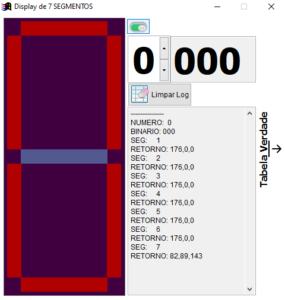

# VFP_Display7Segmentos

Este repositorio é voltado para testes em um projeto que foi demonstrado na faculdade.

Tivemos ensinamento sobre tabela verdade,
e foi montado o esquema do Display de 7 segmentos para ligar os numeros de 0-7.

Foi demonstrado a montagem utilizando um simulador (LOGISIM).
(https://www.youtube.com/watch?v=1thhPwGlnqI)

A lógica utilizada para ligar cada segmento (LED), foi extraida em cima da tabela verdade.
Em cima das tabelas, fiz esse exemplo em FOXPRO seguindo a lógica da tabela verdade.